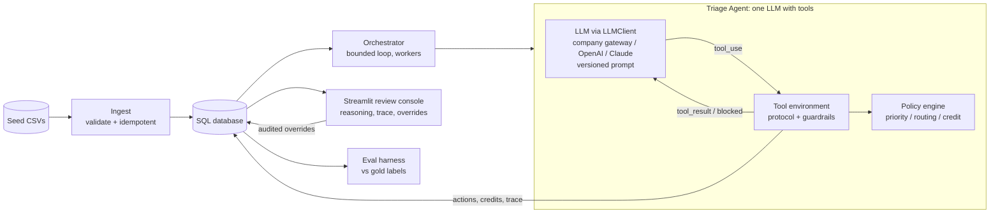
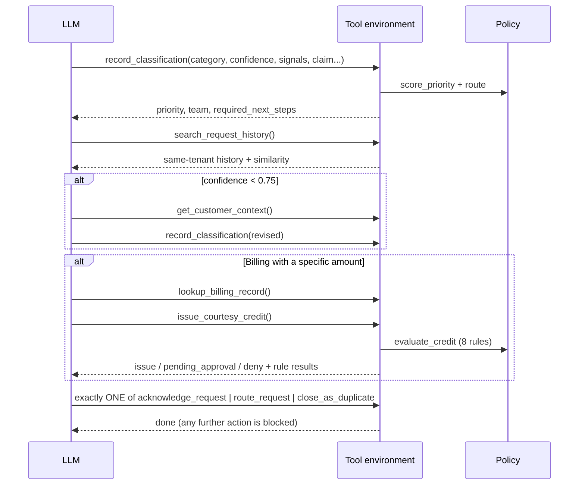
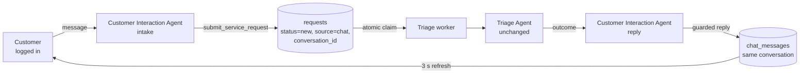

<!-- Original path: docs/ARCHITECTURE.md -->
# Meridian Care: AI Triage Agent Architecture

## 1. Problem
Meridian Self Storage customer care receives a continuous stream of tenant requests. Staff read each one and decide what it is, how urgent it is, who owns it, and whether the tenant is owed money. This is slow and inconsistent.

We automate that front desk with an agent. It is allowed to act on its own (acknowledge, route, close duplicates, issue small courtesy credits), but only inside guardrails that code enforces. A human can see and override everything.

The seed data (100 requests, 29 billing records) is deliberately adversarial:

| Trap | Example | Required behaviour |
|---|---|---|
| Goodwill demand | Anjali: "$210 back would make this right" (record 33.85) | Never pay the claimed amount; route to a human |
| Record shows no discrepancy | Delphine claims $8, Callum claims $40 (record 0.00) | No credit |
| Tenant owes money | Rosalind "charged twice?" (record −338.90) | No credit |
| Amount above auto-limit | Percival ~$310 (record 308.60) | A human must approve |
| Name collision | Marguerite *Effiong* vs Marguerite *Solheim* | Exact-name match only |
| True duplicate | Renwick TR-6039 vs his open TR-6038 | Auto-close and link |
| False duplicates | Four different tenants, identical text | Not duplicates |
| Urgency that is only loud | "URGENT", Business Elite tier, "no rush" | Rank by real harm and deadline |
| Real emergency | Sprinkler dripping while the tenant is leaving in an hour; active water plus mold | P1, sent to the emergency team |
| Multilingual | Spanish double-charge request | Classify correctly and reply in Spanish |
| Vague claim | "not sure by how much", "a couple dollars", hearsay | Not checkable, so no auto-credit |

## 2. Architecture

### Why a single agent does the triage
Triage is one sequential decision per ticket: understand it, gather evidence, decide, act. There are no independent sub-problems to run in parallel, and every step depends on the one before.

Splitting triage into classifier, billing and router agents would add hand-offs, extra LLM calls, latency, cost and failure points without adding accuracy. All the specialist knowledge (billing rules, routing tables, priority weights) is deterministic, so it lives in code as tools and policy rather than in extra agents. Parallelism comes from running many triage workers at once, one per ticket.

A second agent is added only where the job is genuinely different: talking to the customer (section 2b).

### Core principle: the LLM proposes, the policy decides
| The LLM does (language and judgement) | Deterministic code does (money and state) |
|---|---|
| Classify into the 5 categories, with confidence | Compute priority P1–P4 from the signals (auditable weights) |
| Extract urgency signals from the text | Route to a team from the category, priority and confidence |
| Extract the claimed amount, the claim type and whether the claim is specific | Decide credit eligibility and the credit amount (always the verified record) |
| Choose which tools to call and when | Enforce the tool order, a single final action, and duplicate validity |
| Write reasoning for staff and messages for tenants | Validate tenant messages (no invented amounts or promises) |

### Agent workflow for one request

### Tools
| Tool | Type | Key guardrail |
|---|---|---|
| `record_classification` | reasoning capture | Strict schema with enums; policy returns the priority, team and required next steps |
| `search_request_history` | data (tool #1) | Scoped to the current tenant by exact name; no identifier arguments |
| `get_customer_context` | data (tool #2) | **Required** when confidence < 0.75 |
| `lookup_billing_record` | data | Allowed only for Billing requests; **required** for a specific billing claim |
| `issue_courtesy_credit` | money | Takes no amount argument; the 8-rule policy check; cap $50 |
| `acknowledge_request` | final action | Valid only after a credit was issued (resolves the request) |
| `route_request` | final action | The team comes from policy, not from the LLM |
| `close_as_duplicate` | final action | Same tenant, earlier, still open; not P1 into a lower priority |

## 2b. Customer chat: a second agent

Tenants now raise issues themselves through a chat. The CSV loader stays for bulk and evaluation data, and every request is tagged `source = chat | csv`.

**Why two agents now.** The two jobs are different, and the split earns its cost:
- The **Customer Interaction Agent** faces the customer. It understands the real need, asks a clarifying question when the message is vague, and doesn't open tickets for small talk. It writes a friendly reply in the customer's language.
- The **Triage Agent** faces operations. It classifies, prioritises and routes the request, and can issue a credit.

They never call each other directly. They hand off through the database, which acts as a durable queue, so a crash loses nothing and each side scales on its own.

**Routing replies to the right customer.** The browser session is never used as identity:
- Each chat thread is a `conversation` owned by exactly one customer account (a UUID).
- A chat request stores its `conversation_id` and `customer_user_id`.
- The worker writes the reply into that conversation.
- Every read checks ownership (`chat.py`).

Hundreds of customers can chat at once, each sees only their own messages, and the history survives a refresh or logout.

**Concurrency.** Each request is claimed with a conditional `UPDATE ... WHERE status IN ('new','open')`, and each notification with `WHERE customer_notified_at IS NULL`. Any number of worker threads, processes or replicas can therefore run: every request is triaged once and every customer is notified once. Claims stuck for more than 10 minutes are re-queued. The Streamlit process runs one embedded worker, and `python -m meridian worker` adds more. For hundreds of concurrent users, switch to PostgreSQL (a URL change) and run several app replicas.

**What the Interaction Agent can do (its tools):**
| Tool | Purpose |
|---|---|
| `search_knowledge_base` | Answer general questions (gate hours, fobs, late fees, move-out...) without opening a ticket |
| `submit_service_request` | Open a ticket for a real problem |
| `respond_to_credit_offer` | Accept or decline a credit the Triage Agent offered |
| `add_note_to_request` | Attach follow-up details to the customer's own open ticket |
| `get_ticket_status` / `get_my_requests` | Explain one ticket's status, or list the customer's tickets (all or only open) |
| `send_reply` | Write the reply after triage, from the structured outcome |

**Over-claim offer.** If a chat customer claims more (or less) than the verified record and every other credit rule passes, the Triage Agent does not simply refuse. It offers the **verified** amount (credit status `offered`, request `awaiting_customer`). A clear "yes" from the customer issues it after the rules are re-checked (the record is unchanged, still under the cap, no other credit issued). A "no" routes it to the Billing Team. CSV requests have no one to ask, so they are routed as before.

**Guardrails for the Interaction Agent:**
- The customer's name and tier come from the account set up by an administrator, never from the chat. A customer can't claim another tenant's billing record.
- The request body is the customer's own words, verbatim, never LLM text.
- A reply may only mention a dollar amount from the customer's own text, a knowledge-base result, an offered or issued credit, or the customer's own ticket. There are no refund promises.
- Enforced in code, not only in the prompt: one ticket per conversation; asking about a ticket or listing tickets never opens one; a question such as "what's the latest update?" is never read as accepting an offer.
- Limits: 2,000 characters per message and 5 tickets per customer per hour.
- If the LLM fails, a template reply is used and the issue is still logged.
- A customer can delete a conversation from their list. It is hidden, not erased: its tickets keep being worked on and the admin keeps the transcript.

**Access.** The landing page has a customer portal and an administrator portal. An account can only sign in to its own portal. Customer accounts are created by administrators in the **Customers** tab or with `create-user --role customer`.

## 3. Guardrails (defence in depth)
1. **Money:**
   - The credit amount always comes from the verified billing record. The tool has no amount argument, so neither prompt injection nor model error can change it.
   - Eight rules must all pass: Billing category; confidence ≥ 0.8; eligible claim type (never goodwill); a specific claim; exact-name record; record > 0; claimed amount within ±max($2, 10%) of the record; no prior credit.
   - Above the $50 cap, the credit becomes `pending_approval` for a human.
   - A process-wide lock plus a unique constraint prevent double payouts.
2. **Protocol:** the agent cannot skip required steps (classify → history → context when unsure → billing lookup when a claim is made). Exactly one final action is allowed; anything after it is blocked.
3. **Output:**
   - Tenant messages are limited to 600 characters.
   - A message may not mention any dollar figure except an issued credit.
   - Promises such as "we will refund" are blocked unless a credit was issued.
4. **Prompt injection:**
   - Tenant text is fenced as `<tenant_request>` and the prompt labels it as untrusted.
   - Data tools take no identifiers (least privilege).
   - Money tools take no amounts.
   - Every tool schema is strict (`additionalProperties: false`).
5. **Uncertainty:** low confidence (below 0.75) forces a context lookup. If final confidence is below 0.55, the request goes to **Human Triage** and no duplicate close or credit is allowed.
6. **Safety:** a P1 with active damage or a safety risk goes to **Facilities Emergency Response** and cannot be closed as a duplicate into a lower-priority ticket.
7. **Bounded execution and safe failure:**
   - Maximum of 8 steps.
   - SDK timeouts and retries with backoff.
   - Server-side refusal fallback.
   - Any error, refusal, exhausted step budget, or missing final action results in a `fallback_route` to Human Triage. A request is never dropped and never auto-actioned on a failure path.
8. **Transparency:** blocked attempts are returned to the model as errors it can correct, and stored with `allowed=False` so reviewers see what was prevented.

## 4. Quality of AI output
- **Structured output.** A strict tool schema with enums means every classification is machine-valid, never free text to parse.
- **Explainable.** Reviewers see the reasoning, a one-line summary, the urgency signals, and the exact priority arithmetic (`base 15 | active_property_damage +60 | time_critical_deadline +30 = 105 -> P1`) and routing rule.
- **Self-correcting.** When a tool shows the model it was wrong (for example, customer context), it re-records its classification. Every revision is kept.
- **Measured.**
  - `data/gold_labels.csv` holds a hand-labelled expected outcome for all 100 requests. Where a request is ambiguous, several answers are accepted.
  - Metrics: category, priority and action accuracy; **P1 recall**; **credit precision (target 100%: zero wrong payouts)**; strict credit recall; fallbacks; guardrail blocks; steps; latency; cost.

## 5. Production readiness
| Concern | Implementation |
|---|---|
| Model portability | `LLMClient` interface with four implementations: company LLM gateway (OpenAI-compatible), OpenAI, Claude, and an offline deterministic agent; provider and model set in `.env` |
| Reliability | SDK retries and backoff on 429/5xx, timeouts, refusal fallback, safe fallback to humans |
| Idempotency | Ingest skips existing IDs; only untriaged requests are processed; unique credit per request; one credit per customer |
| Concurrency | Thread-pool workers with one DB session each; money operations serialised |
| Observability | JSON logs with PII fields redacted; each run stores model, prompt version, steps, tokens, latency and cost; a full tool trace per request |
| Auditability | Every agent action and human override is stored with actor, time and reason |
| Cost | Prompt caching on the fixed system prompt and tools; `effort=medium` for short-horizon triage; per-run cost tracking |
| Config and secrets | `pydantic-settings` reading `.env`; no secrets in code; policy thresholds in config, not in prompts |
| Data | SQLAlchemy 2.0; SQLite (WAL) for the demo; Postgres by changing the URL |
| Deployment | Dockerfile (non-root user, healthcheck); `run.ps1` |
| Testing | 99 pytest tests: every data trap, protocol enforcement, output guardrails, failure modes, overrides, the two-agent hand-off, concurrent claims, conversation ownership, the offer flow and a full offline end-to-end run |
| Change safety | Versioned prompts (`prompts/triage_v1.md`); the eval gates any change to the prompt or model |

### Scaling path
- **Throughput:** provider batch APIs for backlogs.
- **Architecture:** a queue such as SQS or Redis in front of the workers; Postgres; OpenTelemetry export of the run traces.
- **Access:** role-based access in the console.
- **Monitoring:** drift checks by sampling human overrides as new gold labels.

## 6. Human in the loop
The review console provides:
- a priority-sorted queue with filters
- for each request: the tenant message, the LLM reasoning, the priority calculation, a step-by-step tool trace (blocked calls highlighted), the actions taken, and the tenant messages sent
- overrides for category, priority, team and status, where a reviewer name and reason are mandatory
- confirming the agent's decision
- reopening a closed duplicate
- reversing an issued credit, and approving or rejecting pending or offered credits
- for chat requests, the full customer conversation and the Interaction Agent's summary
- a Customers tab to create customer accounts
- an audit log and an insights tab (priority, team and category mix, overrides, guardrail blocks)

## 7. Known limitations
- Requests that fit none of the 5 categories (for example, a pest schedule or a boat trailer) are forced into the closest one with low confidence. In production a sixth "General Inquiry" category would be better, but the brief fixes the five.
- Duplicate detection relies on the LLM's judgement plus structural guards. Very large histories would need retrieval (embeddings) instead of returning the whole history.
- The offline keyword agent exists to test the plumbing and to demo without a key. It was written after reading this dataset, so its scores are **not** a meaningful baseline.
